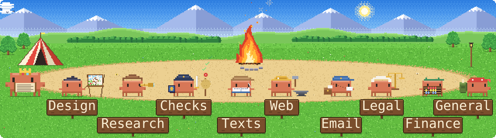

<a href="README.md">English</a> · 中文

# Claude Code 配置

<picture><source media="(prefers-color-scheme: dark)" srcset="assets/hero-c-night.svg"></picture>

一个不写代码的人的配置：由 Claude Code 在 8 个项目里干活。两条规则把它串在一起。谁做出来的东西，谁不来评判。没有批准，任何东西都不发送、不发布。

## 请求流程

<picture><source media="(prefers-color-scheme: dark)" srcset="assets/quest-map-night.svg"></picture>

| 步骤 | 发生什么 | 部件 |
|---|---|---|
| 1 请求 | 项目在自己的终端配置里打开。规则、记忆和状态加载。可先用 Ctrl+G 整理提示词。 | P02 P03 P04 P18 |
| 2 分类 | 小活：立刻办。有边界的：一行计划，最多 3 个问题。大活：进入第 3 步。 | P01 |
| 3 开场问卷页 | 一个问题网页，建议答案已勾好。**等待回答。** | P06 |
| 4 Brief 和计划 | 先写 brief，再列步骤、帮手和成本估算。 | P01 |
| 5 帮手 | 同时最多 3 到 4 个，每个都从 brief 开始。 | P05 P08 P13 |
| 6 检查 | Boss loop，见下文。 | P07 |
| 7 交付 | 汇报分为查到的、估计的、建议的。检查过才算“完成”。 | P01 |
| 8 关卡 | 任何要发送、发布、付费或永久删除的东西，都要等对这份具体稿件的点头。**等待批准。** | P09 P10 P14 P15 |
| 9 保存 | 更新状态和记忆，供下一个会话使用。 | P03 P20 P21 |

## Boss loop（老板循环）

<picture><source media="(prefers-color-scheme: dark)" srcset="assets/boss-loop-night.svg"></picture>

1. **标尺。** 一个具体的“好”的例子，绝不用形容词。
2. **工人。** 一块活一个帮手。没有两个会碰同一个文件。
3. **检查员。** 一个没有任何前情的新帮手。它打开并使用成果，然后对每项标准打 0 到 10 分。
4. **发现的问题。** 阻塞项退回给工人。可选项只在还剩一轮时才做。
5. **结束。** 最多 3 轮。完成指没有阻塞项，且每项标准都在 9 分以上。

用于所有要公开的东西和设计工作。不用于初稿和小修补。

## 安全

- 一次点头只对应一份具体稿件。新的内容或收件人需要新的点头。
- 同一道关卡还管发帖、发布、推送代码、付款、付费生成和永久删除。
- 一个例外：发给我自己 Telegram 的状态消息，只在我不在 Mac 前时发，22:00 到 07:00 绝不发。
- 一个 hook（钩子）会拦住最糟糕的不可逆命令，即使模型忘了规则。
- 所有密钥都放在一个上锁的地方，绝不出现在文字、记忆或历史里。
- 配置改动有版本记录和备份。删除意味着进废纸篓。

## 部件

| # | 部件 | 它是什么 |
|---|---|---|
| P01 | Šéf（捷克语“老大/主管”的意思） | 主会话的风格：给请求分类、做计划、委派、汇报。 |
| P02 | 规则 | 每个会话先读的指令：一份全局文件和 4 份规则文件。 |
| P03 | 记忆与状态 | 每个项目：用记忆笔记存事实，用状态文件记现在的进展。 |
| P04 | 项目 | 8 个项目文件夹，各有自己的规则、状态和终端配置。 |
| P05 | 帮手 | 按活单独交代任务的 subagent（子智能体）。Opus 负责统领和检查，Sonnet 做例行工作，Haiku 做查找。 |
| P06 | 开场问卷页 | 大活之前，把问题做成可点选的网页。 |
| P07 | Boss loop | 上面的质量检查。 |
| P08 | Skills | 只在需要时才加载的指令包（skill）。共 35 个，其中 10 个只能手动启动。 |
| P09 | Safe stop | 没有对具体稿件的点头，什么都不发送、不发布。 |
| P10 | 守卫 hook | 一个在命令运行前检查命令的脚本。 |
| P11 | 密钥库 | 所有访问密钥的唯一上锁存放处。 |
| P12 | 撤销轨迹 | 配置的版本历史，以及每次改动前的备份。 |
| P13 | 工具 | 用于浏览器、UI 组件和创意应用的 MCP 服务器；用于邮件、日历、文件和文档的连接器。 |
| P14 | Družina（捷克语“队伍/小队”） | 一个 Mac 窗口，把会话实时画成像素风营地。可在其中批准或拒绝请求。 |
| P15 | Telegram | 我不在 Mac 前时，在手机上收到请求和状态，带“批准”和“拒绝”按钮。 |
| P16 | Stream Deck | 6 个按键组成的状态显示：会话、用量限额、上下文、模型、睡眠。 |
| P17 | 状态栏 | 终端底部显示模型、努力程度、上下文和用量限额。 |
| P18 | 提示词润色 | Ctrl+G 把潦草的提示词改写成清楚的请求。 |
| P19 | 事件日志 | 只记录每个会话做了什么的元数据，绝不含内容。供 P14、P16 和 P21 使用。 |
| P20 | 保存 | “ulož”（保存）在工作结束时写入状态和记忆。 |
| P21 | 总览 | “přehled”（总览）在一个屏幕上显示所有项目。 |

<picture><source media="(prefers-color-scheme: dark)" srcset="assets/party-roles-night.svg"></picture>

## 家当清单

<picture><source media="(prefers-color-scheme: dark)" srcset="assets/inventory-night.svg"></picture>

数字由脚本根据配置自身的文件统计，截至 2026 年 10 月 6 日。角色：Clawd，Anthropic 的吉祥物，来自 Claude Code；营地、帽子和道具是为 Družina 画的。与 Anthropic 无关。字体：Pixelify Sans、IBM Plex Mono（SIL 开源字体许可）。
